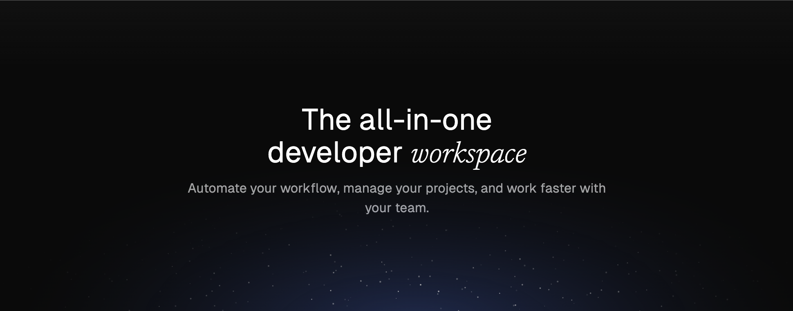

# Shelve - The all-in-one development workspace

<!-- automd:badges color=black license provider=shields name=@shelve/cli -->

<!-- /automd -->

### Table of Contents

- 🚀 [Getting Started](#project-introduction)
- ✨ [Key Features](#key-features)
- 📦 [Technologies Used](#technologies-used)
- 🤝 [Contributing Section](#contributing-section)
- 📚 [Documentation Links](#documentation-links)
- 💬 [Community & Support](#community--support)
- 📜 [License & Credits](#license--credits)

## Project Introduction

Shelve is an all-in-one development workspace that simplifies environment management and project collaboration. With Shelve, developers can easily manage environment variables, collaborate on projects, and enhance their development workflow.

### Project Vision
Shelve aims to become the go-to development workspace for developers. From creating projects to managing environments, Shelve provides a seamless experience for developers worldwide.

### Current Status and Future Ambitions
Shelve is currently in active development, with a focus on adding new features and improving existing functionalities.

The key features of the future version of Shelve will include:
- Ecosystem management (Syncing files across multiple repositories for example) to make big ecosystem like [UnJs](https://unjs.io) easier to manage.
- Support for more integrations like GitHub, Vercel, Coolify, by syncing environment variables and project settings.
- Powerful project creation with automatic setup (auto GitHub repository creation, auto Vercel deployment, etc.) Ready to use in seconds.
- Major UI improvements to make Shelve one of the most beautiful and easy-to-use development tools.

## ✨ Key Features

### 🔐 Environment Management
- **Secure Variable Sharing**: Share environment variables securely within teams
- **Vault System**: Share secrets instantly without account creation
- **Multi-Environment Support**: Manage different environments (production, staging, development or even custom ones)
- **Auto-formatting**: Automatic key formatting and validation

### 🛠️ Developer Experience
- **CLI-First Approach**: Powerful CLI for seamless workflow integration
- **Zero Config**: Automatic project detection and setup
- **Drag & Drop**: Import .env files directly from your desktop
- **Password Generator**: Built-in secure value generator

### 👥 Team Collaboration
- **Team Workspaces**: Organize projects and environments by team
- **Role-Based Access**: Granular permission management
- **Activity Monitoring**: Track changes and access logs
- **Shared Templates**: Reusable environment templates

### 🚀 Deployment & Integration
- **Self-Hostable**: Full control with Docker support
- **GitHub Integration**: OAuth and repository management
- **One-Click Deploy**: Easy deployment with Coolify

### 🔒 Security First
- **End-to-End Encryption**: Secure storage of sensitive data
- **OAuth Authentication**: Secure login with GitHub or Google
- **Role-Based Access Control**: Fine-grained permission management

### USPs (Unique Selling Points)
- **Simplified Environment Management**: Manage environment variables with ease
- **Secure and Private Workspace**: Securely share secrets and collaborate with teams
- **Modern and Intuitive Interface**: User-friendly design for a seamless experience
- **CLI-First Approach**: Powerful CLI for seamless workflow integration
- **Self-Hostable**: Full control with Docker support

### Advantages over Existing Solutions
- **All-in-One**: Shelve is not only an environment manager but also a project complete workspace for creating and managing projects.
- **Free and Open-Source**: Shelve is free to use and open-source, making it accessible to all developers. No more 20$ per month for a simple environment manager feature like some competitors (*cough* Vercel *cough*).
- **Secure and Private**: Shelve provides end-to-end encryption and secure sharing, ensuring the safety of your data.
- **Easter Eggs**: Shelve is full of surprises, the more you use it, the more you discover hidden features.
- **Community-Driven**: Shelve is built by developers, for developers, with a strong focus on community feedback and contributions.

### Technologies Used
- Nuxt
- Tailwind CSS
- TypeScript
- Turborepo
- Bun
- Docker
- DrizzleORM
- Resend
- Zod

## Contributing Section
For more detailed about contributing, please refer to the [Contributing Guide](CONTRIBUTING.md).

## Documentation Links

### Link to Full Documentation
For comprehensive documentation, visit the [Shelve Documentation](https://shelve.cloud/docs).

### Self-Hosting
To self-host the Shelve application, refer to the [Self-Hosting Section](./docker/README.md).

## Community & Support

### Community Links
- [GitHub Issues](https://github.com/HugoRCD/shelve/issues)

### Where to Ask Questions
For questions and support, join our [Discord Community](https://discord.gg/shelve) or open an issue on GitHub.

### How to Report Bugs
To report bugs, open an issue on the [GitHub Issues](https://github.com/HugoRCD/shelve/issues) page.

### How to Suggest Features
To suggest new features, open an issue on the [GitHub Issues](https://github.com/HugoRCD/shelve/issues) page.

## License & Credits

### Acknowledgements
We would like to thank all contributors and the open-source community for their support.

<!-- automd:contributors license=Apache author=HugoRCD,CavallucciJohann -->

Published under the [APACHE](https://github.com/HugoRCD/shelve/blob/main/LICENSE) license.
Made by [@HugoRCD](https://github.com/HugoRCD), [@CavallucciJohann](https://github.com/CavallucciJohann) and [community](https://github.com/HugoRCD/shelve/graphs/contributors) 💛
  

<!-- /automd -->

<!-- automd:with-automd lastUpdate -->

---

_🤖 auto updated with [automd](https://automd.unjs.io) (last updated: Wed Nov 27 2024)_

<!-- /automd -->
