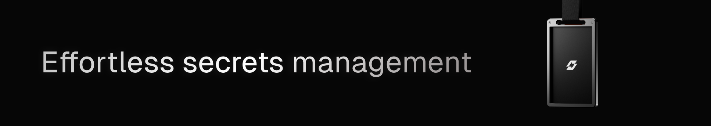

  

# Shelve
### Open-Source Secrets Management, Simplified.

**Centralize, secure, and sync your environment variables & secrets effortlessly. Built with exceptional Developer Experience (DX), aiming to become your unified development workspace.**

[Website](https://shelve.cloud) • [Documentation](https://shelve.cloud/docs/getting-started)

---

## 📑 Table of Contents

Click to expand

- [📋 Overview](#-overview)
  - [🎯 The Vision](#-the-vision)
  - [🗺️ Status & Roadmap](#️-status--roadmap)
- [✨ Key Features](#-key-features)
  - [🔒 Secure Secrets Management](#-secure-secrets-management)
  - [💻 Developer Experience (DX)](#-developer-experience-dx)
  - [🔄 Sync & Integrations](#-sync--integrations)
  - [👥 Team Collaboration](#-team-collaboration)
- [🤔 Why Shelve?](#-why-shelve)
- [🛠️ Tech Stack](#️-tech-stack)
- [🤝 Contributing](#-contributing)
- [📚 Documentation](#-documentation)
  - [📖 Full Documentation](#-full-documentation)
  - [🏠 Self-Hosting](#-self-hosting)
- [💬 Community & Support](#-community--support)
- [📄 License & Credits](#-license--credits)

## 📋 Overview

> **Shelve provides the secure foundation for effortless secrets management.** Stop juggling `.env` files and scattered keys. Bring clarity, security, and synchronization to your application configurations.

Shelve tackles the common frustrations of managing environment variables and secrets in modern development: the security risks, the collaboration friction, and the time wasted on manual processes. We provide a centralized, secure, and intuitive platform designed from the ground up with developer experience as the priority.

### 🎯 The Vision

While Shelve excels at secrets management today, our vision extends further. We are building towards a unified **developer workspace** – a central hub designed to streamline critical development workflows, eliminate friction, and integrate seamlessly with the tools you already use. Secrets management is the cornerstone, but the goal is broader productivity and flow.

### 🗺️ Status & Roadmap

<table>
  <tr>
    <td>🏗️ Current Status</td>
    <td>Active Development & Production Ready</td>
  </tr>
  <tr>
    <td>📅 Next Release</td>
    <td>v2.1.0 (Target: Q2 2025)</td>
  </tr>
</table>

#### Upcoming Focus

-   🔄 **Multi-Repo Config Sync:** Manage configuration files (dotfiles, CI templates) across multiple repositories.
-   🔌 **Enhanced Integrations:** Deeper connections with platforms like Vercel, Netlify, etc.
-   ⚡️ **Workflow Automation:** Streamlining project setup and deployment processes.

## ✨ Key Features

### 🔒 Secure Secrets Management

-   **Centralized Vault:** Securely store API keys, tokens, variables in one organized dashboard.
-   **Encryption:** Secrets hashed (`SHA-256`) and encrypted (`AES-256`) at rest.
-   **Environment Parity:** Easily manage configurations across `dev`, `staging`, `prod`, and custom environments.
-   **Secure Sharing:** Built-in Vault for time-limited, secure secret sharing.
-   **Validation & Formatting:** Ensure consistency and prevent errors.

### 💻 Developer Experience (DX)

-   **Command Palette (`Cmd+K`):** Instantly search, navigate, and execute actions.
-   **Powerful CLI (`@shelve/cli`):** Fetch, push, and inject secrets (`shelve run`) directly from your terminal.
-   **Intuitive UI:** Clean, modern, and efficient interface built with Nuxt UI.
-   **Zero Config:** Automatic project detection and sensible defaults.

### 🔄 Sync & Integrations

-   **GitHub Sync:** Automatically sync secrets with GitHub Actions & Repository secrets via the official GitHub App.
-   **CLI Sync:** `shelve pull` and `shelve push` for seamless terminal workflows.
-   **API Access:** (If applicable) Programmatic access for custom integrations.

### 👥 Team Collaboration

-   **Workspaces:** Organize projects and secrets for teams.
-   **Role-Based Access Control:** Simple and effective permissions (Owner, Admin, Member).
-   **Seamless Sync:** Ensure everyone has the right configuration at the right time.

## 🤔 Why Shelve?

-   **Effortless & Secure:** Provides a robust, reliable foundation for managing your most sensitive configurations without the usual complexity.
-   **Exceptional DX:** Designed by developers, for developers, focusing on speed, intuition, and reducing friction (CLI, Cmd+K, clean UI).
-   **Open Source & Accessible:** Completely free to use, transparent development, and driven by the community. No feature paywalls for core functionality.
-   **Flexible & Integrated:** Offers seamless GitHub integration, a powerful CLI, and self-hosting options (Docker, Coolify) for full control.

## 🛠️ Tech Stack

-   **Framework:** Nuxt
-   **UI:** Nuxt UI, Tailwind CSS
-   **Server:** Nitro
-   **Database:** DrizzleORM, SQLite (or preferred DB via Drizzle)
-   **Monorepo:** Turborepo
-   **Deployment:** NuxtHub, Docker, Coolify
-   **Mailer:** Resend
-   **Validation:** Zod
-   **CI/CD:** GitHub Actions

## 🤝 Contributing

We thrive on community contributions! Whether it's code, documentation, bug reports, or feature ideas, we welcome your help. Please see our [Contributing Guide](https://shelve.cloud/docs/contributing) to get started.

## 📚 Documentation

### Full Documentation

For comprehensive guides, API references, and setup instructions, visit the [Shelve Documentation](https://shelve.cloud/docs/getting-started).

### Self-Hosting

Want full control? Deploy Shelve on your own Vercel account using [Vercel](https://shelve.cloud/docs/self-hosting/vercel).

## 💬 Community & Support

-   **Issues & Feature Requests:** [GitHub Issues](https://github.com/HugoRCD/shelve/issues) (Best for bugs & feature tracking)
-   **Questions & Discussion:** (Consider adding GitHub Discussions if enabled, or Discord/Slack if you have one)
-   **Direct Contact:** contact@shelve.cloud

## 📄 License & Credits

Published under the [APACHE-2.0](https://github.com/HugoRCD/shelve/blob/main/LICENSE) license.

### Acknowledgements

A huge thank you to all contributors, sponsors, and the incredible open-source community that makes projects like Shelve possible.

<!-- automd:fetch url="gh:hugorcd/markdown/main/src/sponsors.md" -->

## Sponsors

  

<!-- /automd -->

<!-- automd:contributors license=Apache-2.0 author=HugoRCD -->

Made with 💛 by [@HugoRCD](https://github.com/HugoRCD) and [community](https://github.com/HugoRCD/shelve/graphs/contributors).
  

<!-- /automd -->

<!-- automd:with-automd lastUpdate -->

---

_🤖 auto updated with [automd](https://automd.unjs.io) (last updated: Sat Apr 12 2025)_

<!-- /automd -->

